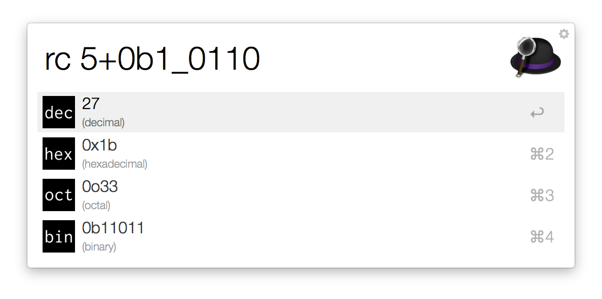

[](https://travis-ci.org/goodell/radix-calc)

# radix-calc

This is a simple programmer's calculator written in Rust.  It can be used
directly on the command line as an alternative to `printf "0x%x\n" $(( ... ))`
shell expressions, though it's main purpose is to support an
[Alfred](https://www.alfredapp.com/) workflow.

## Examples

```
$ radix-calc 5+5
10

$ radix-calc '5 + 0xa - 0o17 * 0b11'
-30

$ radix-calc --bin "0b0110 ^ 0xc"
0b1010

$ radix-calc --all "0b0110 ^ 0xc"
10
0xa
0o12
0b1010
```

For better ergonomics I often abbreviate `radix-calc` as `rc` in my shell
startup files:

```sh
alias rc=radix-calc
```

## Alfred Workflow

One of the main reasons that `radix-calc` was developed was to power an
[Alfred](https://www.alfredapp.com/) workflow.  That workflow bundles the
`radix-calc` binary, so it may not work on older versions of OS X / macOS (as
of the time of this writing I only have have access to 10.12 "Sierra"
machines).



To install it, just open the
[`radix-calc.alfredworkflow` file](https://github.com/goodell/radix-calc/raw/master/alfred/radix-calc.alfredworkflow)
either downloaded directly from GitHub or from a cloned version of the
repository.

## Future Enhancements

- convert all signed integer arithmetic to use `wrapping_add()` and friends to
  avoid undefined behavior?
- toggle type width/signedness with shift/option/ctrl/cmd modifier keys?

## Author

Dave Goodell <dave@goodell.io>
Twitter: [@davidjgoodell](https://twitter.com/davidjgoodell)

The main calculator icon is from
[Aiconica](http://aiconica.net/search/Calculator), licensed CC0 1.0.  The
dec/hex/oct/bin icons are original and also CC0 1.0.

## License

MIT License, see the `LICENSE` file.
